# Курсовая работа

University: [ITMO University](https://itmo.ru/ru/)
Faculty: [FICT](https://fict.itmo.ru)
Course: [Cloud platforms as the basis of technology entrepreneurship](https://) ADD link
Year: 2025/2026
Group: U4125
Author: Deviatilova Olga
Lab: Coursework
Date of create: 11.10.2025
Date of finished: 15.10.2025

## "Создание персонального сайта с использованием MkDocs"

### 1. Установила Python и MkDocs

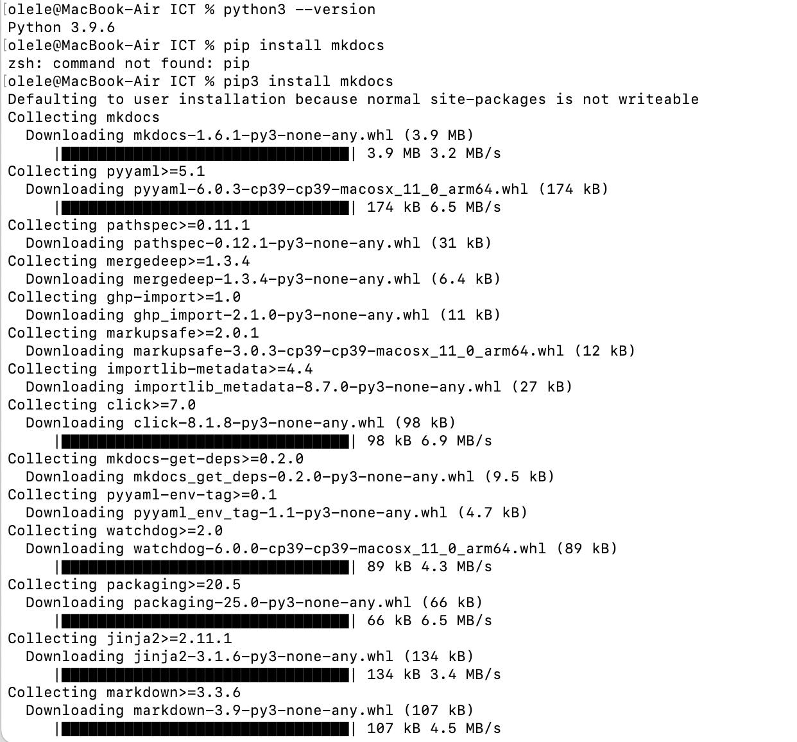

### 2. Создание нового проекта

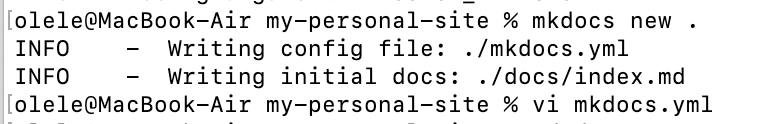

### 3. Настройка конфигурации

Настройка базовых параметров, настройка навигации, добавление логотипа, настройка поиска, настройка цветовой темы, настройка футера

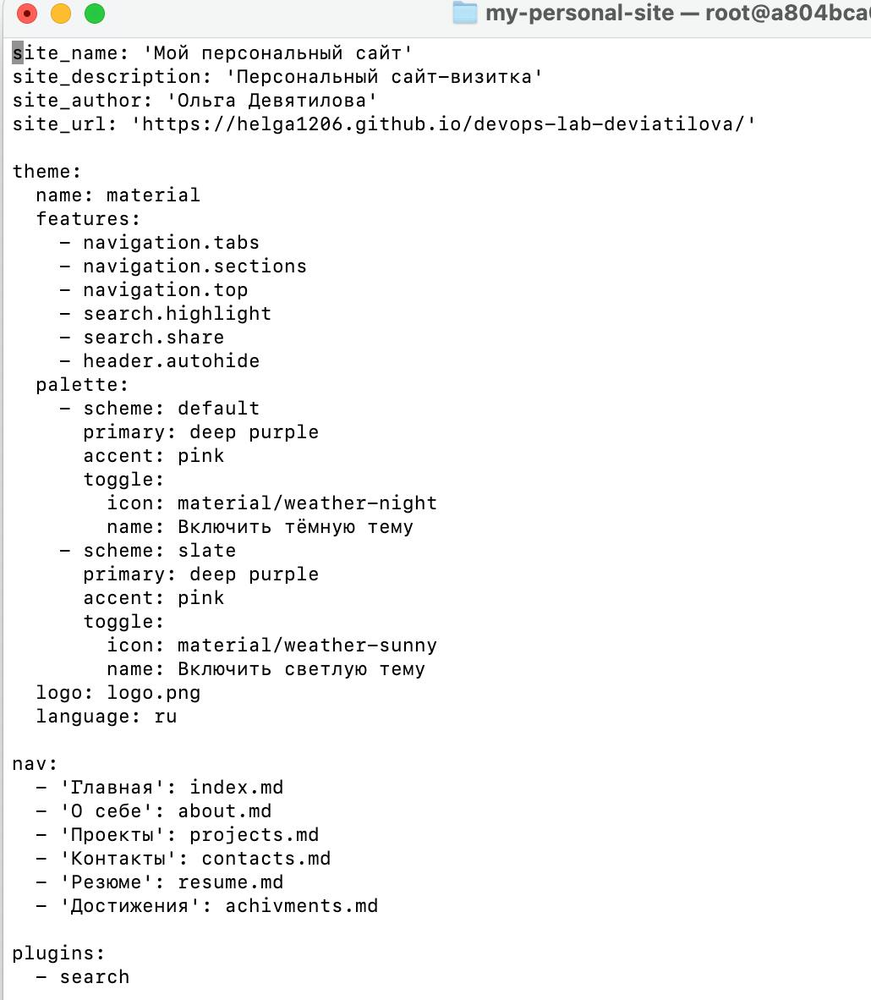

### 4. Наполнение контента

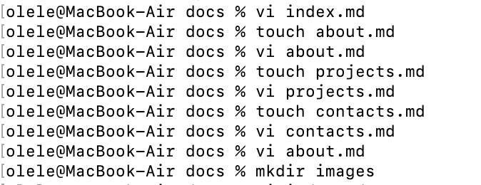

### 5. Локальное тестирование

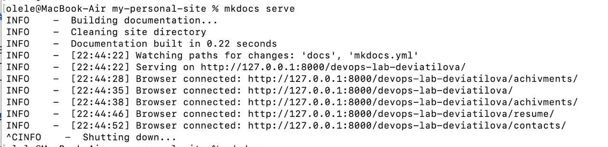

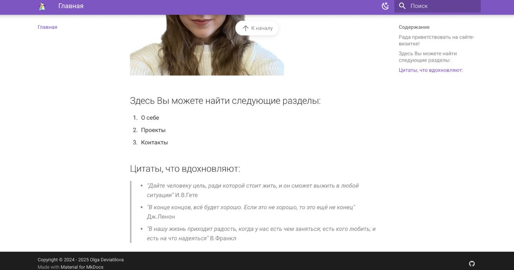

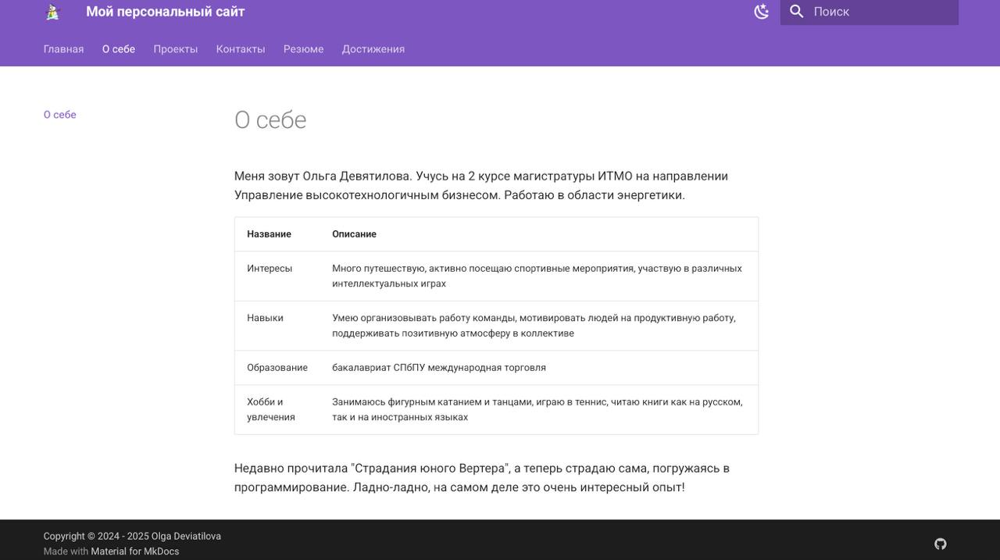

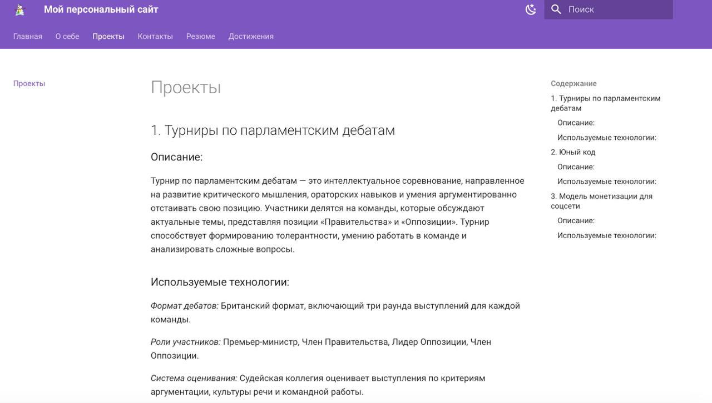

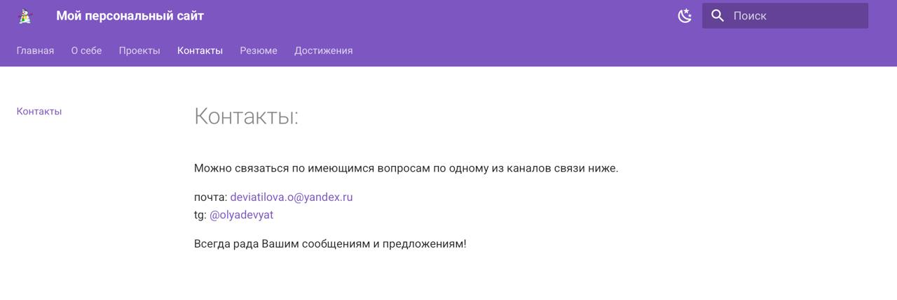

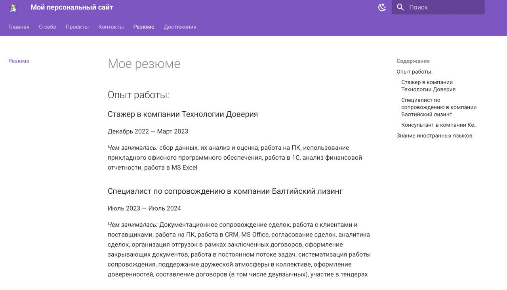

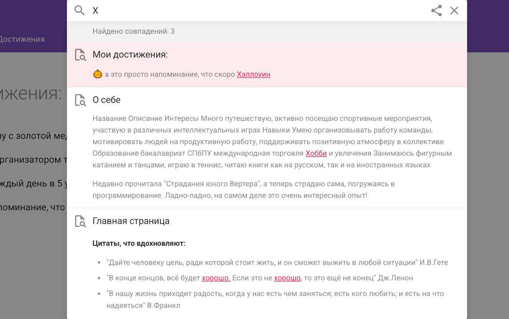

### 6. Сборка сайта

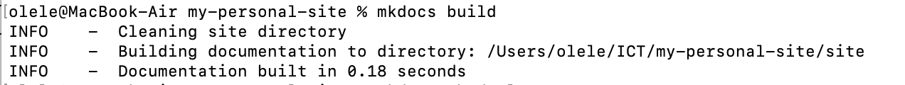

Сайт задеплоен по ссылке: [https://helga1206.github.io/devops-lab-deviatilova/](https://helga1206.github.io/devops-lab-deviatilova/)

