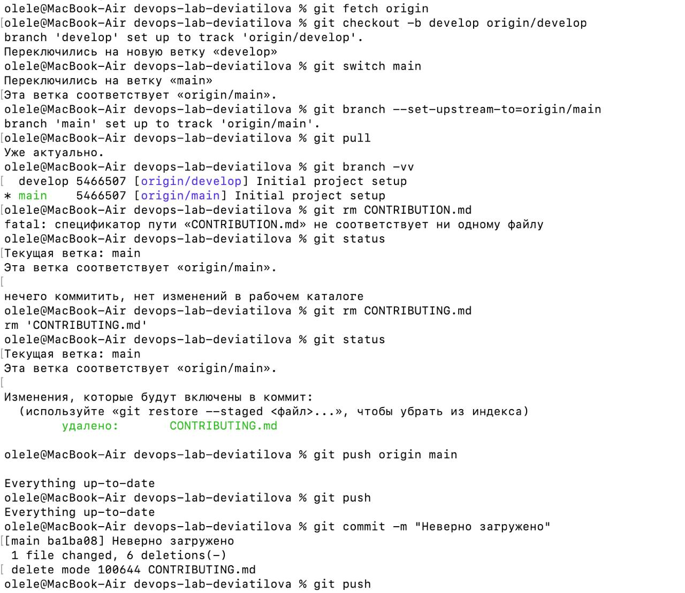
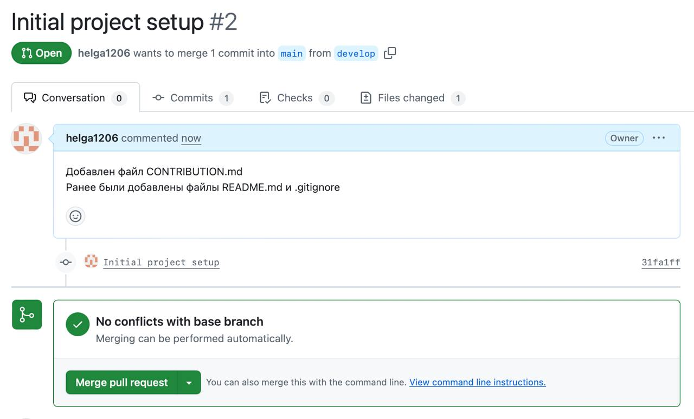

University: [ITMO University](https://itmo.ru/ru/)
Faculty: [FICT](https://fict.itmo.ru)
Course: [Cloud platforms as the basis of technology entrepreneurship](https://) ADD link
Year: 2025/2026
Group: U4125
Author: Deviatilova Olga
Lab: Lab0
Date of create: 30.09.2025
Date of finished: 03.10.2025

Выполняла лабораторную работу исходя из задания. 
Сначала немного запуталась в ветках поэтому пришлось их переназначать и переподвязывать с локальным репозиторием.

Потом удалила файл, который надо было сначала запушить в ветку develop, а затем уже отправлять пул реквест.
Собственно добавила потом файл заново и сделала новый пулреквест.

Затем создала папку для новой лабораторной.
И вот написала отчет.
Теперь подгружу его в удаленный репозиторий и ура, первая лабораторная сделана.

