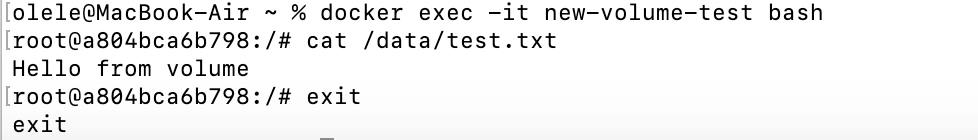

University: [ITMO University](https://itmo.ru/ru/)
Faculty: [FICT](https://fict.itmo.ru)
Course: [Cloud platforms as the basis of technology entrepreneurship](https://) ADD link
Year: 2025/2026
Group: U4125
Author: Deviatilova Olga
Lab: Lab1
Date of create: 03.10.2025
Date of finished: 06.10.2025

# Изучение основ Doker:

## 1.Установка Docker:

Установила Doker, проверила установку, запустила тестовый контейнер и изучила базовые команды.

## 2.Работа с готовыми образами:

Скачала образ Ubuntu, запустила интерактивный контейнер, внутри контейнера установила пакет curl, проверила установку и вышла из контейнера.

## 3.Запуск веб-сервера:

Запустила контейнер с nginx, проверила работу в браузере, посмотрела логи контейнера, подключилась к нему и вышла.

## 4.Управление контейнерами:

Провела базовые операции с контейнерами, удалила контейнер, удалила образ.

## 5.Работа с томами(volumes):

Создала том и запустила контейнер с параметрами:
-it — интерактивный режим
--name volume-test — имя контейнера
-d — запуск в detached-режиме
-v my-volume:/data — монтирование тома
ubuntu — образ для запуска
bash — команда для выполнения

Подключилась к контейнеру, создала файл и удалила контейнер.

Создала новый контейнер с тем же томом, проверила, что он созранился.

