University: [ITMO University](https://itmo.ru/ru/)
Faculty: [FICT](https://fict.itmo.ru)
Course: [Cloud platforms as the basis of technology entrepreneurship](https://) ADD link
Year: 2025/2026
Group: U4125
Author: Deviatilova Olga
Lab: Lab2
Date of create: 10.10.2025
Date of finished: 13.10.2025

# Настройка CI/CD пайплайна с GitHub Actions:

## 1. Подготовка проекта:

Создала новый репозиторий на github: https://github.com/helga1206/my-flask-app.git
И скопировала туда файлы.

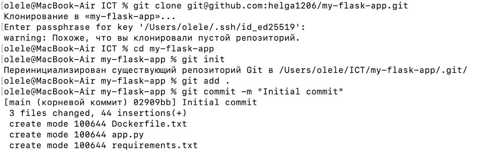

И создала аккаунт на Docker Hub.

## 2. Настройка GitHub Actions:

Создала папку .github/workflows/ в корне проекта и файл docker-build.yml с пайплайном, который должен:
Запускаться при пуше в main ветку
Использовать Ubuntu как runner
Выполнять checkout кода
Настраивать Docker Buildx
Логиниться в Docker Hub используя секреты
Собирать и пушить образ с тегом username/my-flask-app:latest
Добавлять шаг деплоя (можно просто echo сообщение)

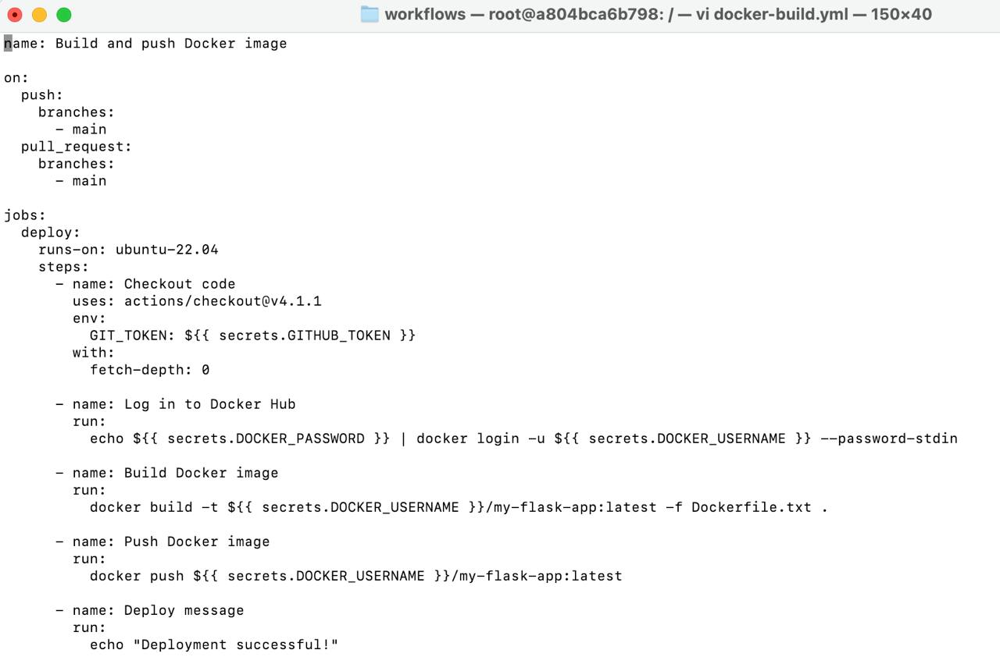

## 3. Настройка секретов:

Добавила в настройках GitHub репозитория секреты:

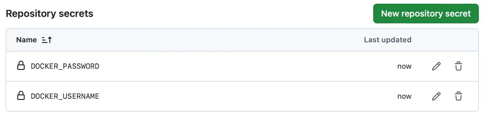

## 4. Тестирование пайплайна:

Сделала коммит и пуш в main ветку

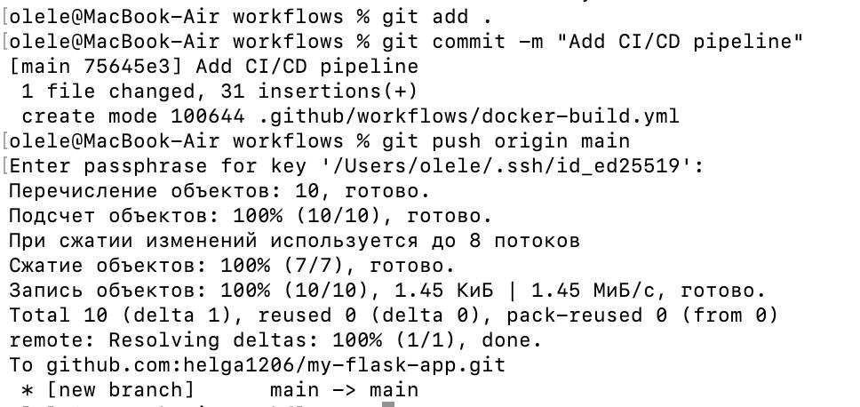

Проверила выполнение пайплайна в разделе Actions

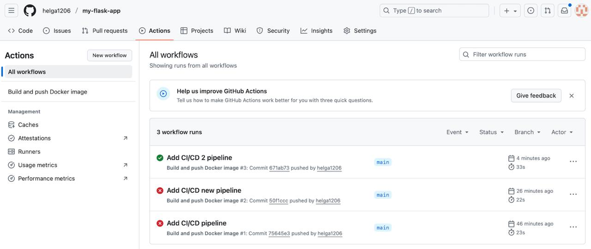

Убедилась, что образ появился в Docker Hub

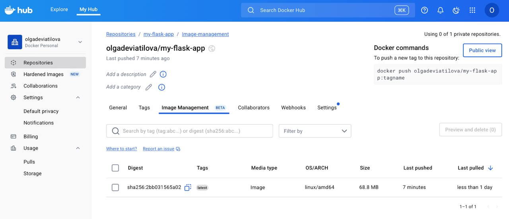

Проверила логи выполнения каждого шага

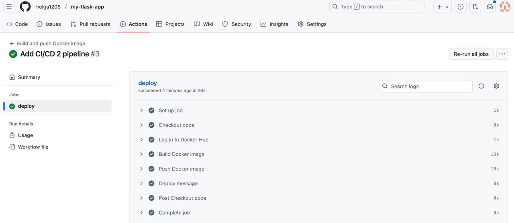

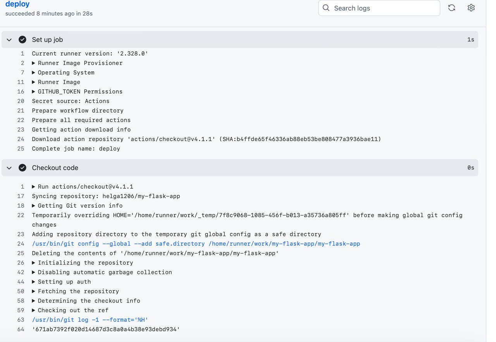

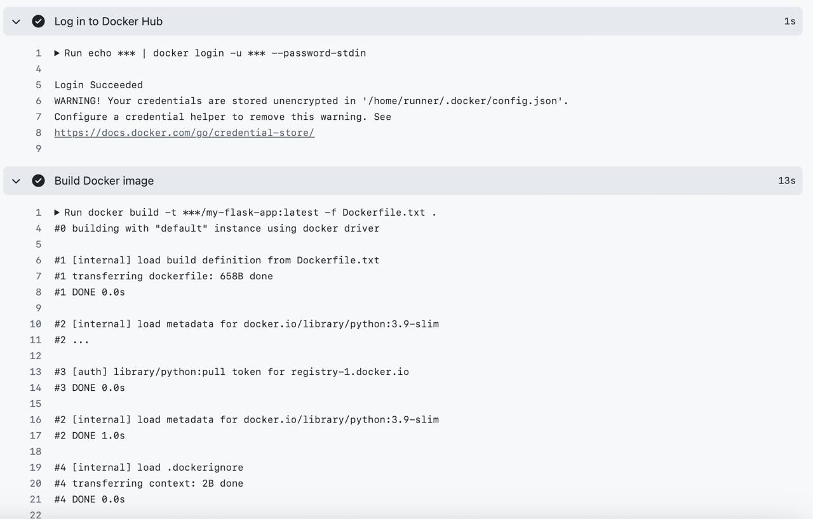

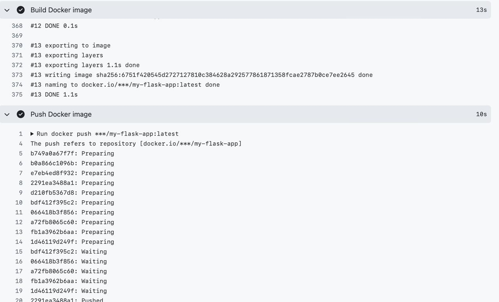

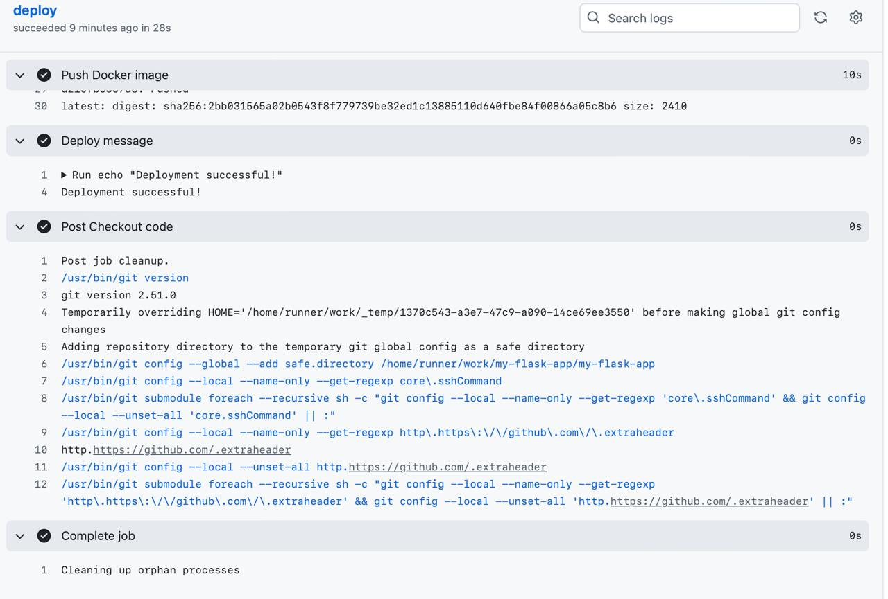

