University: [ITMO University](https://itmo.ru/ru/)
Faculty: [FICT](https://fict.itmo.ru)
Course: [Cloud platforms as the basis of technology entrepreneurship](https://) ADD link
Year: 2025/2026
Group: U4125
Author: Deviatilova Olga
Lab: Lab3
Date of create: 11.10.2025
Date of finished: 13.10.2025

# Настройка мониторинга с Prometheus и Grafana

## 1. Создание конфигурации Prometheus:

Создала папку prometheus и файл prometheus.yml

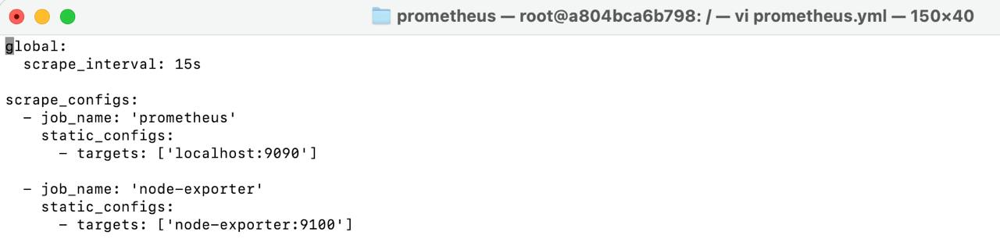

## 2. Запуск Node Exporter:

Запустила контейнер Node Exporter для сбора системных метрик и проверила работу

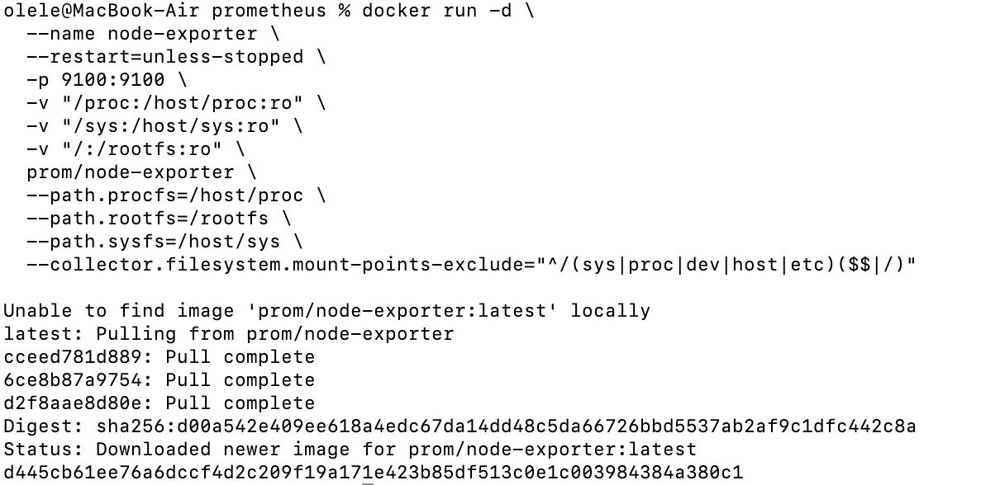

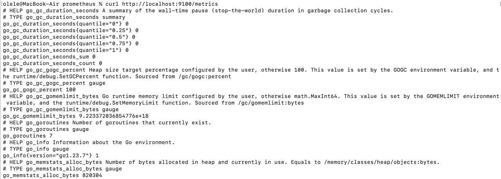

## 3. Запуск Prometheus:

Создала том для данных Prometheus, запустила контейнер и проверила работу, открыв ссылку в браузере

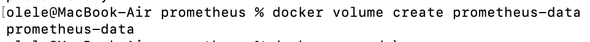

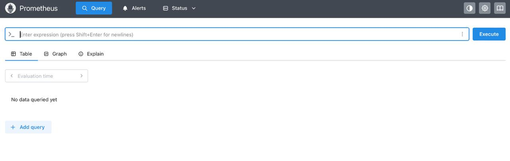

## 4. Запуск Grafana:

Создала том для данных Grafana, запустила контейнер и проверила работу в браузере

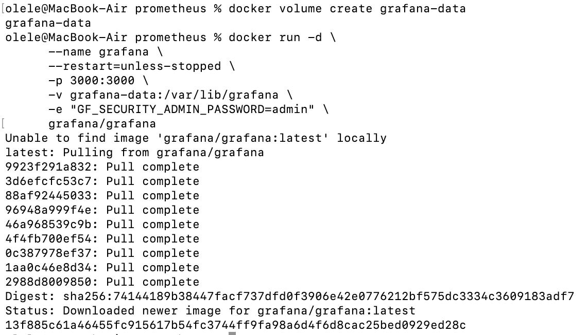

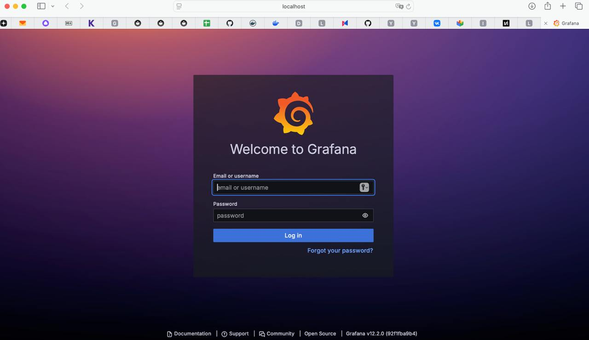

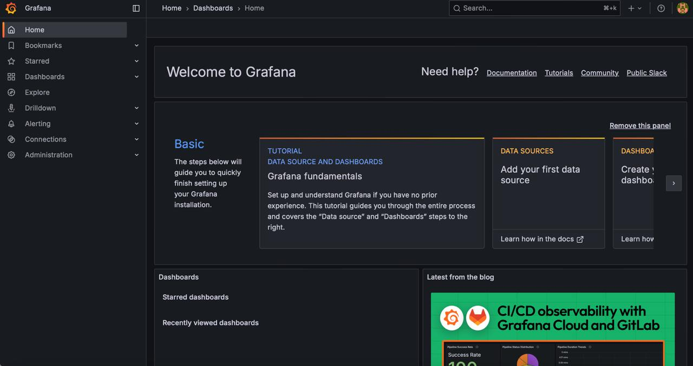

## 5. Настройка Grafana:

Зашла в Grafana, добавила источник данных Prometheus, но при сохранении и тестировании возникла ошибка.
Поэтому обновила конфигурацию Prometheus с использованием единого IP-адрес хоста: host.docker.internal, перезапустила все контейнеры.
После этого Grafana успешно подключилась к Prometheus.

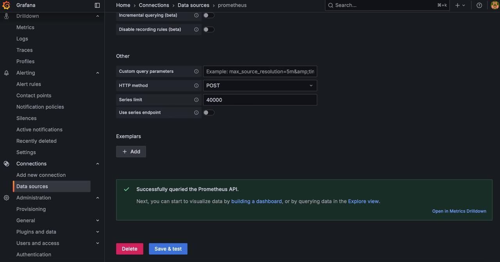

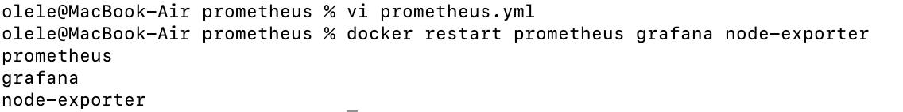

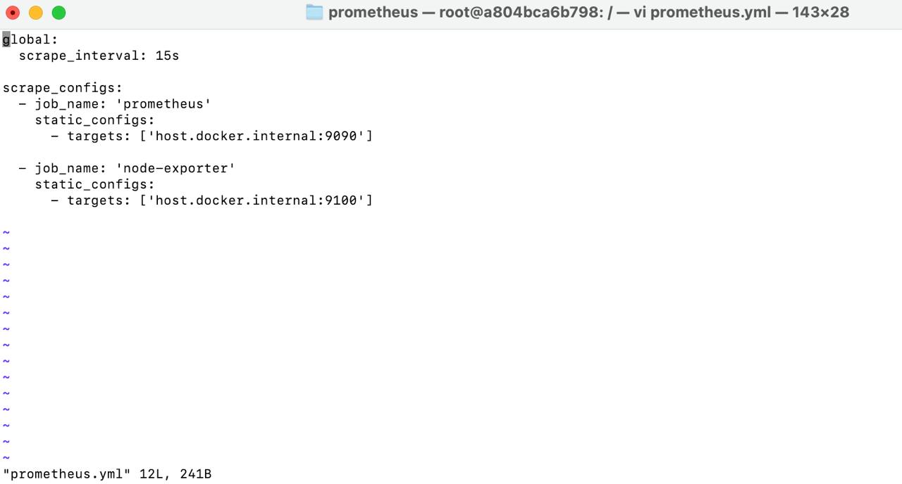

Создала дашборд с меетрикой node_cpu_seconds_total и сохранила его

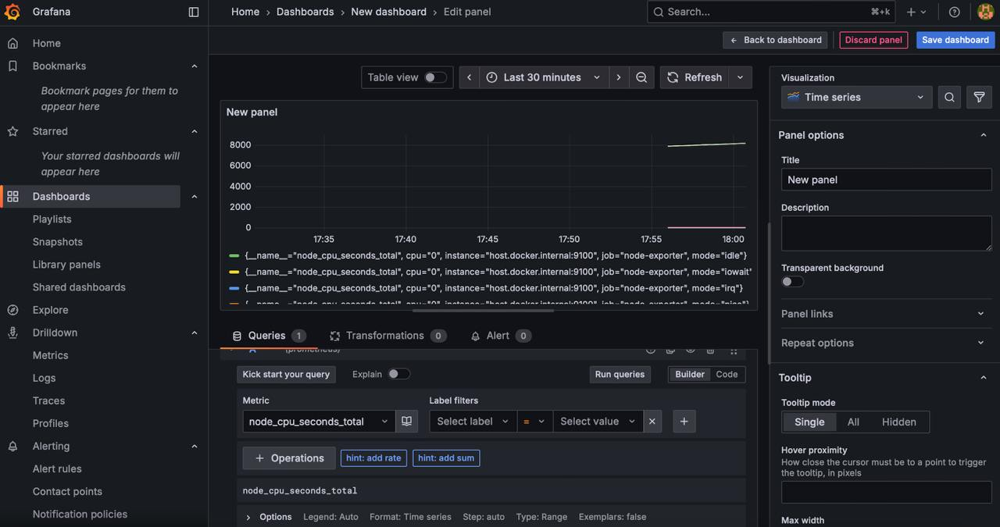

## 6. Тестирование системы:

Проверила все контейнеры, убедилась, что метрики собираются и графики отражаются с разными метриками

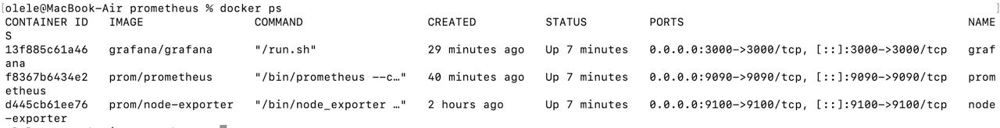

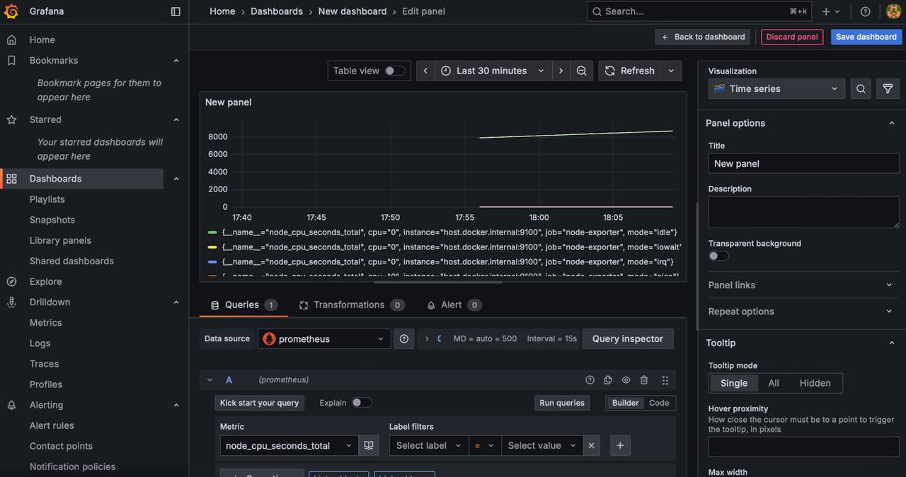

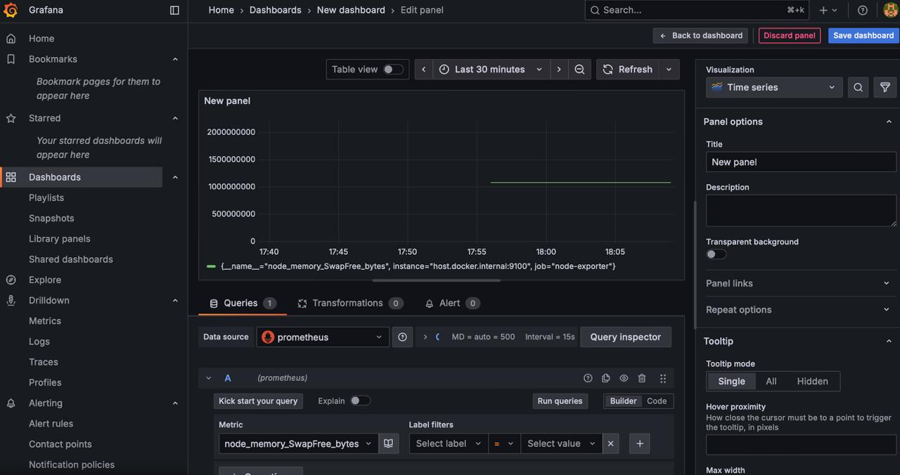

